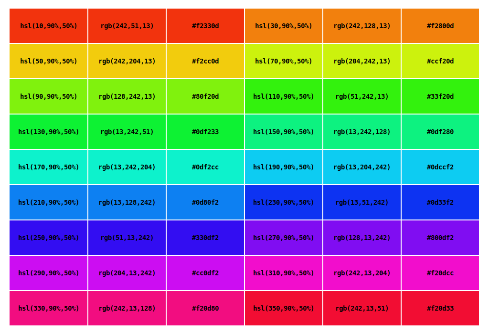

# JS Color Palette

> Geração de paleta de cores HSL, RGB e HEX com Javascript

`<wip/> <!-- work in progress -->`

**Visualização**

``` bash
npm install
npm run dev
```

### Resultado



---

Sugestões? Envie email para <frontend@ednilsonrobert.dev>
